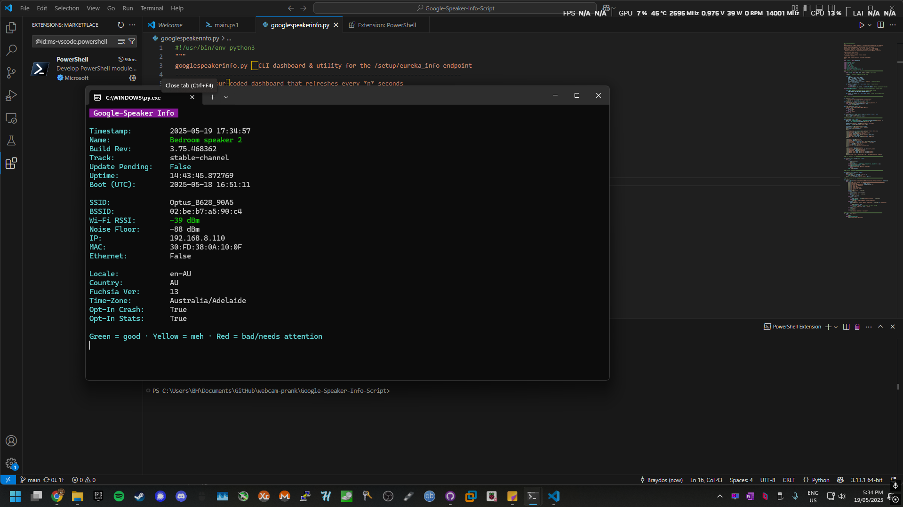

# 🛰️ Google Speaker Info Dashboard

Live terminal dashboard for Google smart speakers (Chromecast, Nest Audio, etc.) using their local API.  
✅ Color-coded  
✅ Menu-driven  
✅ Cross-platform  
✅ Zero cloud required



---

## 📦 Features

- 🔄 Real-time speaker monitoring (updates every 5s)
- 🟢 Color-coded Wi-Fi & status indicators
- 📡 Accesses local `/eureka_info` API (no Google account required)
- ⚙️ Menu options: monitor, one-shot, raw JSON
- 🧼 Minimal dependencies (just `colorama` on Windows)

---

## 🚀 Installation

### 🔧 Requirements

- Python 3.7+
- Device must be reachable on your local network
- *(Optional but recommended)*  
  Enable ANSI colors on Windows:
  ```bash
  pip install colorama
